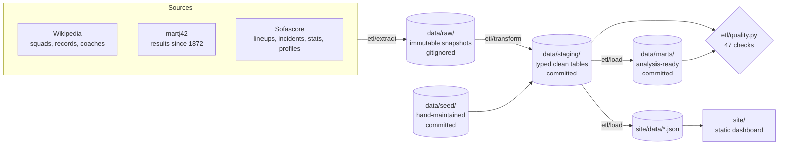

# Architecture

The project is an ETL pipeline plus a static dashboard. Everything is plain Python
and vanilla JavaScript: **no build step, no database, no framework**. That is
deliberate — a contributor should be able to clone, run one command, and see the
whole thing work.

## The one-minute version



One command runs it all; each step can run alone:

```bash
python -m etl all          # extract -> transform -> load -> quality
python -m etl transform    # just re-derive staging from the raw snapshots
python -m etl load         # just rebuild marts + site JSONs from staging
python -m etl quality      # just the checks
python -m etl all --force  # re-download the volatile sources
```

## Why the layers exist

| Layer | Rule | Why it matters to you |
|---|---|---|
| `data/raw/` | Written **only** by `etl/extract`. Never edited, never committed. | Finished matches never change, so extraction is cached and incremental: a re-run fetches only what is new. You can work offline for days. |
| `data/seed/` | Hand-maintained CSVs, committed. | Where human knowledge lives (name variants, coach tenures, retirements). **This is the easiest place to contribute.** |
| `data/staging/` | Written only by `etl/transform`, from raw + seed. Committed. | The clean, typed tables. Because they are committed, you can rebuild every mart and the whole dashboard **without any network access**. |
| `data/marts/` + `site/data/` | Written only by `etl/load`, from staging. Committed. | Analysis-ready outputs. Generated — never hand-edit them. |

The hard rule: **each layer reads only from the layer above.** If you find
yourself wanting to read `data/marts/` inside a transform, the logic belongs in
`load` instead.

## Package map

```
etl/
  config.py        paths, team id, the study window, tunable thresholds
  util.py          csv/json io, name normalisation, numeric coercion
  http.py          the only place that makes network calls
  elo_model.py     pure Elo math (leaf module, no project imports)
  analytics.py     pure formulas: age curves, gates, tiers, chi-square, style axes
  extract/         one module per source -> data/raw/
  parsers/         HTML and payload parsing (no I/O, easy to unit test)
  transform/       raw + seed -> data/staging/
  load/
    registry.py    >>> the single registration point for analyses <<<
    common.py      helpers shared by analyses (points, presence minutes, records)
    profiles.py    the player_profile mart
    formations.py  formation records + the shared opponent-Elo lookup
    performance.py timeline bins, player importance, bench impact
    style.py       playing-style axes
    resilience.py  deficit ladder, replies, clutch players
    leadership.py  captains, goalkeepers
    coaches.py     coach eras
    pipeline.py    youth pipeline
    marts.py       orchestration only: writes what registry declares
    site.py        composes site/data/*.json (+ registry fragments)
  quality.py       the data-quality gate
site/
  index.html effectif.html joueurs.html matchs.html analyse.html
  histoire.html projections.html methodologie.html   <- generated hub pages
  joueurs/<player_id>.html                           <- generated, one per player
  matchs/<date>-<opponent>.html                      <- generated, one per match
  sitemap.xml robots.txt                             <- generated
  data/*.json                                        <- written by etl load
  assets/photos/                                     <- Commons portraits (free licences)
  assets/style.css   tokens, cards, tables, charts
  assets/pages.css   page shell, hero, photo cards, timeline, motion
  assets/i18n.js     FR/EN strings (one dictionary per language)
  assets/core.js     chart plumbing + helpers shared by every section
  assets/sections/   one file per dashboard section
  assets/boot.js     per-page data fetch, renderer dispatch, scroll motion
tools/
  build_site.py      generates every page (python -m etl pages)
  site_builder/      layout.py (shell), hubs.py, detail.py, data.py
  check_links.py     fails if any internal link is broken
  gen_data_model.py  regenerates docs/DATA_MODEL.md from the field constants
```

`analytics.py` and `parsers/` hold **pure functions** — no file or network I/O.
That is why the test suite runs in under a second and needs no fixtures.

## The web layer

**Pages are generated, charts are not.** `tools/build_site.py` emits the HTML for
all ~195 pages. Detail pages (match, player) are fully static HTML — tables,
timelines and CSS comparison bars — so they read without JavaScript and are
indexable. Hub pages keep their charts client-side: each declares the data
documents it needs (`body[data-needs]`) and loads only the section scripts it
uses, and `boot.js` runs a renderer only when its anchor element is present.

Three rules that are easy to break:

- **Shared JS goes in `core.js`.** A constant or helper defined inside one section
  file is undefined on pages that do not load that section.
- **Motion never gates visibility.** Reveal-on-scroll uses transitions with an
  explicit end state, behind an `html.js-anim` flag that JS adds only once it can
  drive the animation, plus a 1.2 s failsafe that reveals everything anyway. A
  paused animation, a hidden tab or disabled JS can never leave the page blank.
  Hero and tile entrances animate `transform` only, never opacity, and all motion
  collapses under `prefers-reduced-motion`.
- **Photos must be freely licensed.** Portraits come from Wikimedia Commons only,
  with licence and author recorded in `data/staging/photos.csv` and credited on
  the methodology page; players without a free portrait get an initials avatar.
  `etl/extract/commons.py` refuses any image whose licence is not explicitly free,
  and press photos from the stats providers are deliberately never used.

After changing a page template, run `python -m etl pages` then
`python tools/check_links.py` — CI runs both.

## Adding an analysis (the four-step recipe)

Say you want "record by month of the year".

1. **Compute it.** Create `etl/load/seasonality.py` with a `FIELDS` list and a
   zero-argument builder returning a list of dicts. Read from `data/staging/`,
   put any reusable formula in `analytics.py`, and gate small samples (see the
   house rules below).
2. **Register it.** Add one entry to `etl/load/registry.py`:
   ```python
   {
       "name": "seasonality",
       "doc": "Record by month of the year.",
       "marts": [("seasonality.csv", seasonality.FIELDS, seasonality.build)],
       "site": {"history": {"seasonality": seasonality.build}},
   }
   ```
   `marts.py` now writes the CSV and `site.py` now puts the data under
   `history.seasonality` in `site/data/history.json`. Nothing else to wire.
3. **Show it.** Add a card to `site/index.html`, a render function in a file
   under `site/assets/sections/`, its `<script>` tag, a call in `renderAll()`
   (`assets/boot.js`), and the FR + EN strings in `assets/i18n.js`.
4. **Guard it.** Add a check function in `etl/quality.py` and call it from
   `run()`; add unit tests for the pure parts under `tests/`. Then run
   `python tools/gen_data_model.py` so the data dictionary picks up your table.

Verify with `python -m pytest -q`, `python -m etl load`, `python -m etl quality`
(must show 0 failures), and serve the site to look at it.

## House rules for every metric

These are not style preferences — they are what makes the numbers defensible on a
team that plays ~15 matches a year.

- **Show the sample.** Every rate is displayed with its raw numerator and
  denominator ("12 of 30", "n = 33 matches").
- **Gate, don't hide.** Below its threshold a value renders as `–` with the row
  greyed, never silently dropped. Thresholds live next to the metric and are
  documented in the dashboard's methodology section.
- **No composite indexes.** Weighted "player scores" are indefensible at this
  sample size. Show components side by side instead.
- **Pool ratios, never average percentages.** `sum(made)/sum(attempted)`, not the
  mean of per-match percentages.
- **Compare like with like.** Team style is always shown against the opponents
  actually faced; formation records carry the average opponent Elo.
- **Descriptive, never causal.** "Possession falls against stronger teams", not
  "possession causes results".
- **One axis per chart.** Different scales get indexed to a common base or split
  into two charts — never a second y-axis.

## Testing and CI

`python -m pytest -q` covers the pure logic: parsers, Elo math, timeline
reconstruction, gates and classifiers. It needs no network and no fixtures on
disk.

CI (`.github/workflows/ci.yml`) runs on every push and pull request:

1. `pytest` — the unit suite.
2. `python -m etl load` — rebuilds every mart and site JSON **from the committed
   staging tables**, so a PR is proven to build without touching the network.
3. `python -m etl quality` — the gate; any `FAIL` fails the build.
4. A check that the generated data dictionary is up to date.

This is why staging is committed: it makes the pipeline reproducible and
reviewable by anyone, with no credentials and no scraping.

## Deliberate limits

- **No database.** CSV + JSON keeps diffs reviewable in a pull request; the
  dataset is thousands of rows, not millions.
- **No frontend build.** Adding `<script>` tags is a smaller barrier than a
  toolchain. The cost is manual ordering in `index.html`.
- **Sofascore is an unofficial API.** Requests are spaced, responses are cached
  forever for finished matches, and raw snapshots are never redistributed.
- **No xG.** The source returns zeros for CAF matches, so it is excluded rather
  than shown as zero.
